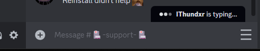

# CSS-Snippets
A compilation of CSS snippets for Vencord / Vesktop.

> [!IMPORTANT]
> Many of the snippets are only guaranteed to work on Vesktop as of currently. Get the latest build here: [Releases - Vencord/Vesktop](https://github.com/Vencord/Vesktop/releases)

| Snippet    | Changes | Image |
| -------- | ------- | ------- |
| [BetterProfiles](BetterProfiles/import.css) | Improves general layout of user profiles, improving readability and visual appeal. |  |
| [BetterQuotes](BetterQuotes/import.css) | Improves blockquotes styling to make it more visible and appealing |  |
| [AccentColor](ChangeColor/AccentColor/import.css) | Replaces the Blurple [#5865F2] accent color with one of your choice. |  |
| [ClientColor](ChangeColor/ClientColor/import.css) | Replaces the Grey [#313338] client color with one of your choice. |  |
| [ChannelSelections](ChannelSelections/import.css) | Allows for more spacing for channel icons & colored unread notifiers. |  |
| [ChatBubbles](ChatBubbles/import.css) | Adds a chat bubble around messages |  |
| [GuildBoost](GuildBoost/import.css) | Replaces the boost bar in guilds with a more appealing indicator |  |
| [GuildList](GuildList/import.css) | Makes the guild/server list more more efficient and more appealing |   |
| [MessageSection-v2](MessageSection/v2/import.css) | Aligns the "Message Section" better and hides its icons a hover menu |  |
| [MessageTypes](MessageUtilities/MessageTypes/import.css) | Includes the message types & actions with the username |  |
| [TimestampBubbles](MessageUtilities/TimestampBubbles/import.css) | Applies a bubble to message timestamps |  |
| [Username](MessageUtilities/Username/import.css) | Applies a bubble to usernames that abide by role color |  |
| [OnekoDM](OnekoDM/import.css) | Replaces the discord logo with Oneko! |  |
| [UserOptions](UserOptions/import.css) | Replaces the profile popout with more streamlined options |  |
| [UserPanel](UserPanel/import.css) | Replaces the user panel with a customizable, more appealing version. |  |

Note: Some screenshots were taken in smaller windows for the sake of fitting in this table. All were taken in Vesktop v0.4.3

## Apply
There are several methods to apply these snippets:

  

Via Local Themes:

  + Click on the folders (and possibly subsequent folders) of the snippet you want until you see the file `import.css`
  + Download the file `import.css` from the folders
  + Open Settings > Vencord > Themes > Local Themes > Open Themes Folder
  + Paste the downloaded file into the **themes** folder

  

Via Online Themes

  + Click on the folders (and possibly subsequent folders) of the snippet you want until you see the file `import.css`
  + Click on that file, then click on the **Raw** button
  + A file will open on your browser, now copy the URL
  + Open Settings > Vencord > Themes > Online Themes
  + Paste the following link into **Theme Links**: `URL HERE`
  + Enter or mouse-click outside the Online Themes box to apply

Via QuickCSS

  + Click on the folders (and possibly subsequent folders) of the snippet you want until you see the file `import.css`
  + Click on that file, then click on the **Raw** button
  + A file will open on your browser, now copy the URL
  + Open Settings > Vencord > Vencord > Open QuickCSS File
  + Paste the following line as your **first line (ahead of any other custom CSS)**: `@import url(URL HERE);`

## Special thanks to
[ant0n-0x0000](https://github.com/ant0n-0x0000) for helping out with the snippets' descriptions!

