# CSS-Snippets

A compilation of CSS snippets for Discord and its custom clients.

> [!IMPORTANT]
> **Update 29.03.2024:** Discord just pushed a huge change that has broken most snippets. Please wait for them to be fixed.
>
> **Update 09.03.2024:** All snippets have changed their respective raw links. You should consider updating those in your configuration again.
>
> **Update 19.02.2024:** GuildList is currently broken, please refrain from using it for the time being.

## List of available snippets

| Snippet    | Changes | Image |
| -------- | ------- | ------- |
| [BetterProfiles](Snippets/BetterProfiles/) | Improves general layout of user profiles, improving readability and visual appeal. Credits to [Saltssaumure](https://github.com/Saltssaumure) for the role pills. | 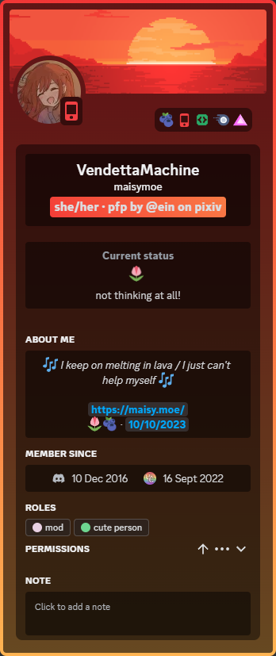 |
| [BetterQuotes](Snippets/BetterQuotes/) | Improves blockquotes styling to make it more visible and appealing. | 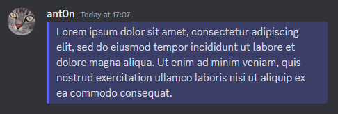 |
| [AccentColor](Snippets/ChangeColor/AccentColor/) | Replaces the Blurple [#5865F2] accent color with one of your choice. | 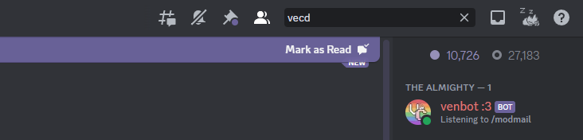 |
| [ClientColor](Snippets/ChangeColor/ClientColor/) | Replaces the Grey [#313338] client color with one of your choice. | 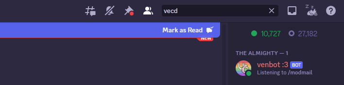 |
| [OtherColors](Snippets/ChangeColor/OtherColors/) | Replace other Discord colors (red, yellow, green, etc.) with Blurple [#5865F2].| 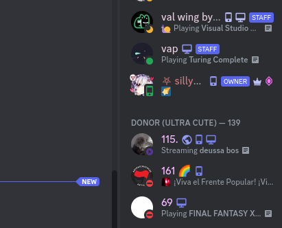 |
| [ChannelSelections](Snippets/ChannelSelections/) | Allows for more spacing for channel icons & colored unread notifiers. | 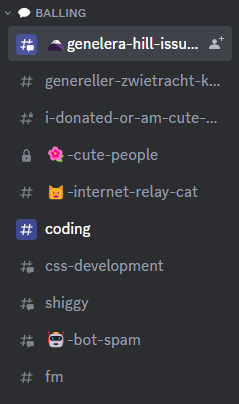 |
| [ChatBubbles](Snippets/ChatBubbles/) | Adds a chat bubble around messages. Different colours are available for normal, replying, mentioned and automod messages. | 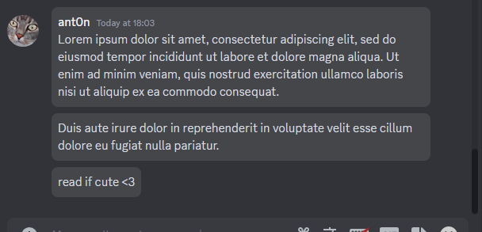 |
| [GuildBoost](Snippets/GuildBoost/) | Replaces the boost bar in guilds with a more appealing indicator | 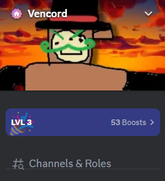 |
| [GuildList](Snippets/GuildList/) | Makes the guild/server list more more efficient and more appealing. |  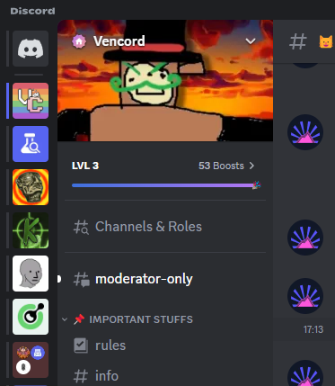 |
| [MessageSection-v2](Snippets/MessageSection/v2/) | Aligns the "Message Section" better and hides its icons a hover menu | 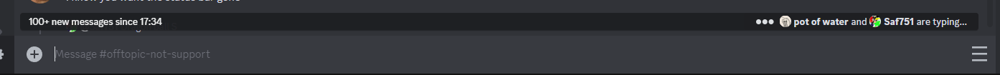 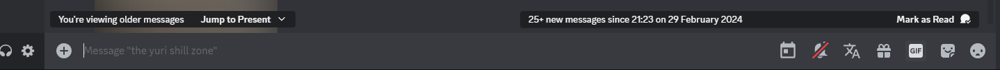 |
| [MessageTypes](Snippets/MessageUltilities/MessageTypes/) | Includes the message types & actions with the username. Currently available in English and German | 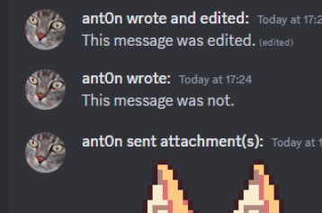 |
| [TimestampBubbles](Snippets/MessageUltilities/TimestampBubbles/) | Applies a bubble styling to message timestamps |  |
| [Username](Snippets/MessageUltilities/Username/) | Applies a bubble to usernames that abide by role color | 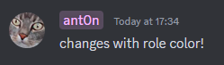 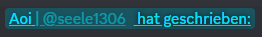|
| [OnekoDM](Snippets/OnekoDM/) | Replaces the discord logo with Oneko! | 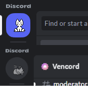 |
| [UserOptions](Snippets/UserOptions/) | Replaces the profile popout with more streamlined options | 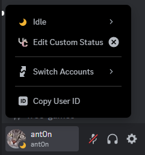 |
| [UserPanel](Snippets/UserPanel/) | Replaces the user panel with a customizable, more appealing version. Includes appearance changes to the Spotify media player. | 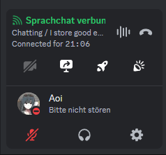 |
| [ToolbarHide](Snippets/ToolbarHide/) | Hides the toolbar at the top for a cleaner layout. | 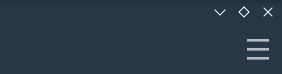 |
| [StaffTags](Snippets/StaffTags/) | Hides the toolbar at the top for a cleaner layout. | 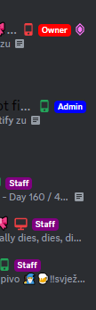 |
| [Titlebar](Snippets/Titlebar/) | Changes the default Discord titlebar to a more visually appealing one. You can customize the text and background color to your liking. | 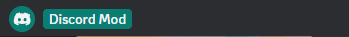 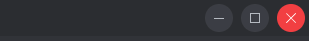 |

## Apply

There are several methods to apply these snippets. The methods below are for Vencord, however other clients have similar methods.

If your client is not [Vesktop](https://github.com/Vencord/Vesktop), the snippets `import.css` might not work properly. In that case, use `import-legacy.css` instead.

  

Via Local Themes:

+ Click on the folders (and possibly subsequent folders) of the snippet you want until you see the file `import.css`
+ Download the file `import.css` from the folders
+ Open Settings > Vencord > Themes > Local Themes > Open Themes Folder
+ Paste the downloaded file into the **themes** folder

  

Via Online Themes

+ Click on the folders (and possibly subsequent folders) of the snippet you want until you see the file `import.css`
+ Click on that file, then click on the **Raw** button
+ A file will open on your browser, now copy the URL
+ Open Settings > Vencord > Themes > Online Themes
+ Paste the following link into **Theme Links**: `URL HERE`
+ Enter or mouse-click outside the Online Themes box to apply

Via QuickCSS

+ Click on the folders (and possibly subsequent folders) of the snippet you want until you see the file `import.css`
+ Click on that file, then click on the **Raw** button
+ A file will open on your browser, now copy the URL
+ Open Settings > Vencord > Vencord > Open QuickCSS File
+ Paste the following line as your **first line (ahead of any other custom CSS)**: `@import url(URL HERE);`

## Special thanks to

[ant0n-0x0000](https://github.com/ant0n-0x0000) for helping out with the snippets' descriptions!

[Saltssaumure](https://github.com/Saltssaumure), [Lexia](https://github.com/exterpolation) for various elements within the snippets

